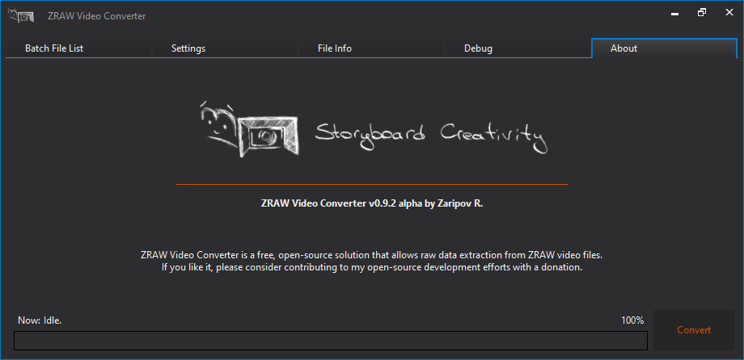

# ZRAW Video Converter

This is a free ZRAW decoder. This tool allows to extract ZRAW video files to DNG sequences or HEVC bitstreams (according to the camera firmware version).

## Community

## How to support the converter development?

You can always help the community by donation:
- BTC: bc1q6pxsepxekzhfecuw0wshmwx4wqwdnlppefwvff
- ETH: 0x90261E953c1E5Bfd6C54A0a725172b156dDeFBD3

## What ZRAW versions are compatible with this software?

For versions before 0.94 you can get pure Bayer CFA (RAW), for later versions - you get real HEVC bitstream extracted from ".ZRAW" file without any reencoding process.
With hacked firmware you get RAW for `"ZRAW (Bayer CFA)"` mode and HEVC for `"ZRAW (HEVC)"` mode.

### Features

- Extracting HEVC from ZRAW for new versions
- Converting ZRAW to DNG sequence for old versions (or for ZRAW files from hacked firmwares)
- Audio extraction
- Timecode extraction
- Proxy stream extraction (if present)
- Batch processing
- JPEG Lossless compression for DNG files

### Supported ZRAW files

| E2 (E2-M4/E2-S6/etc.) firmware version | ZRAW contains | Feature |
| :---: |:---:|:---:|
|  0.93  | Compressed RAW CFA 12-bit | Convert ZRAW to DNG sequence |
|  0.94 - 0.98.2  | HEVC 10-bit 4:2:0 | Extract HEVC video from ZRAW file to `".mov"` |
| 0.98.2 hacked | HEVC 10-bit 4:2:0 or Compressed RAW CFA 12-bit | Extract HEVC video from ZRAW file to `".mov"` or Convert ZRAW to DNG sequence |

## How to build?

##### For Windows
- Get dependencies for project (OpenSSL, for example)
- Open `Visual Studio Developer Command Prompt`, type `msbuild vc2017/zraw-parser.sln /t:zraw-parser.vcxproj /p:Configuration="Release" /p:Platform="x64"` and have fun!

##### For Ubuntu:
- Get dependencies for project (OpenSSL, for example)
- Type `make` and have fun!

## License

Copyright 2021 storyboardcreativity

This software is created solely on a non-commercial basis to ensure compatibility with ZRAW file formats and is licensed under the GNU General Public License version 2 (the "GPL License").

You may obtain a copy of the GPL License in the LICENSE file, or at:

http://www.gnu.org/licenses/gpl-2.0.html

Unless required by applicable law or agreed to in writing, software distributed under the GPL Licesnse is distributed on an "AS IS" BASIS, WITHOUT WARRANTIES OR CONDITIONS OF ANY KIND, either express or implied. See the GPL License for the specific language governing permissions and limitations under the GPL License.
